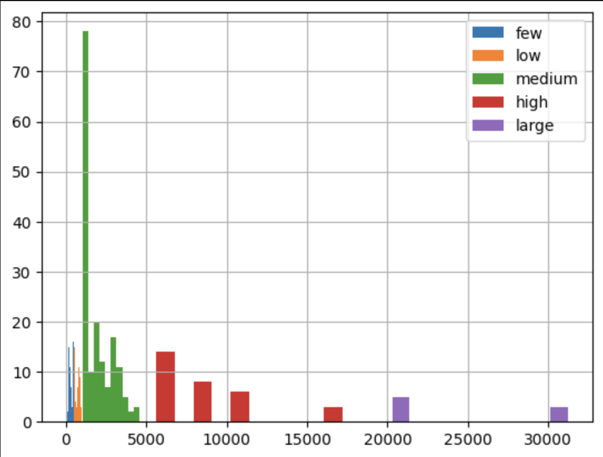

# Boardroom API

##  Execution plan for extracting data from all DAOs

The table below summarizes the results we got after executing the `rag-api-pipeline` on a select set of DAOs with different amount of recods. The last three columns track the total execution time (in seconds) that took to run each of the commands available. During testing, we used a Mac Studio with 32Gb of RAM and a local Ollama provider hosting the `Nomic-embed-text-v1.5` model.

| Protocol | discourseTopics | discourseCategories | discourseTopicPosts | Proposals | Total Records | Chunked | run-all | chunk-only | embed-only |
|--------|--------|--------|--------|--------|--------|--------|--------|--------|--------|
| Aave | 204 | 7 | 15126 | 1267 | 16604 + 1 | 152619 | 3578.19s | 274.59s | 2709.52s |
| NounsDAO | 505 | 5 | 2095 | 632 | 3237 + 1 | 32190 | 847.02s | 90.83s | 759.23s |
| Optimism | 119 | 17 | 19853 | 188 | 20177 + 1 | 120409 | 3784.94s | 279.40s | 2414.94s |
| VitaDAO | 0 | 0 | 0 | 127 | 127 + 1 | 2128 | 92.66s | 24.85s | 52.58s |
| SeedClub | 0 | 0 | 0 | 21 | 21 + 1 |  277 | 29.86s | 16.63s | 9.85s |
| Metacartel | 45 | 5 | 1811 | 624 | 2485 + 1 | 13547 | 455.06s | 58.10s | 369.77s |
| Molochdao | 0 | 0 | 0 | 49 | 49 +1 | 153 |  24.42s | 19.05s | 5.90s |

We used this data to provide a bare estimate of the time it will take to generate a knowledge base for all DAOs/Protocol that Boardroom offers data.

on Sep 19th, 2024, we took a API data snapshot to get the total amount of records that each protocol has. A CSV data can be found [here](records_by_protocol.csv). Then, we segmented the dataset using a pre-determined set of bins with intervals: `{"few": (0, 500), "low": (501, 1000), "medium": (1001, 5000), "high": (5001, 20000), "large": (20001,)}`. The figure below shows the distribution in terms of No. of records

The table below shows the No. of protocols that fall onto each segment. By naively estimating a base average time that it will take to execute the pipeline for a single protocol on each segment, we estimate that approximately **112 hours** will be required to generate a knowledge base for all **383 protocols** currently in Boardroom.

| segment | No. of protocols | Base Avg Time | Total Exec Time |
| ------------------- | ---------------- | ------------- | --------------- |
| few (0, 500)        | 97     | 90s     | ~1h25min |
| low (501, 1000)     | 82     | 600s    | ~13h     |
| medium (1001, 5000) | 165    | 1200s   | ~55h     |
| high (5001, 20000)  | 31     | 3500s   | ~30h     |
| large (20001,)      | 8      | 5400s   | ~12h     |

It is important to mention that execution times for each protocol will also depend on the amount of content each API endpoint returns. For example, the `discourseTopicPosts` endpoint returns beefy contents for protocols that have a lot of activity on their forums.